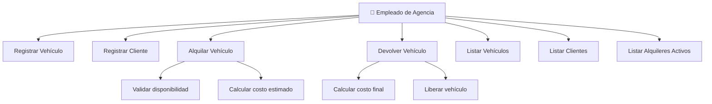
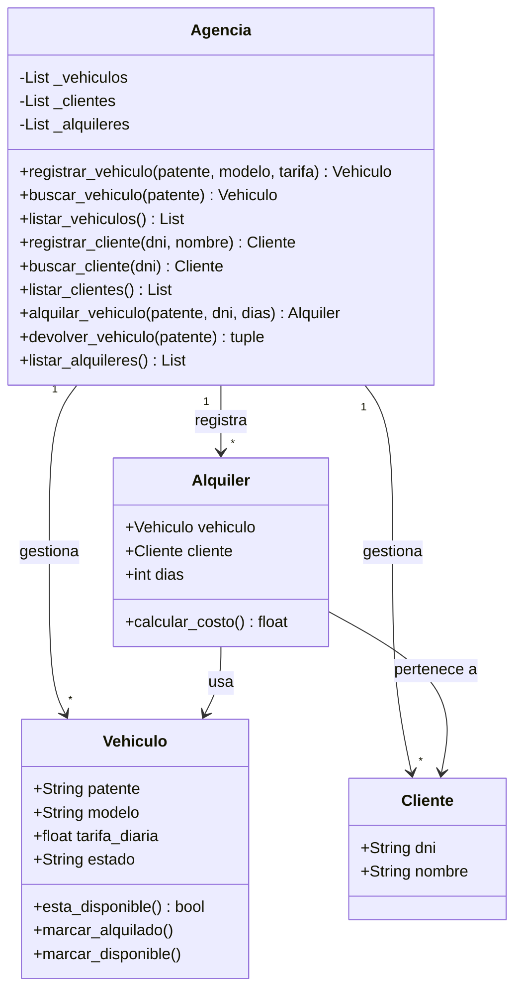
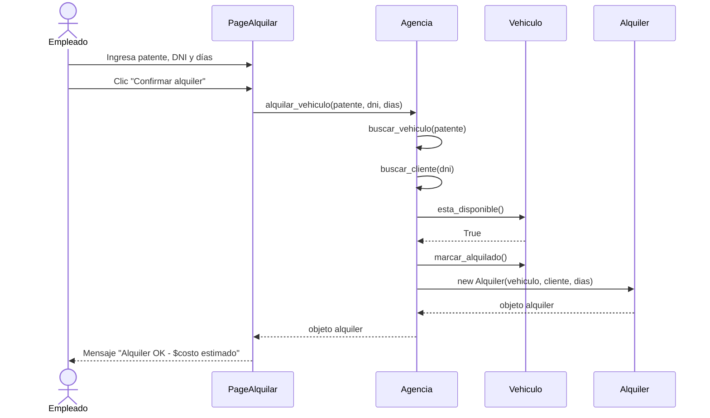

# AutoRent — Sistema de Alquiler de Vehículos

---

## 1. Objetivo del Software

AutoRent es un sistema de escritorio desarrollado en Python que permite gestionar
el alquiler de vehículos de una agencia. Permite registrar vehículos, clientes,
procesar alquileres y devoluciones, calculando el costo total automáticamente.

---

## 2. Requerimientos Implementados

### Funcionales
- RF01: Registrar vehículos con patente, modelo y tarifa diaria.
- RF02: Registrar clientes con DNI y nombre.
- RF03: Alquilar un vehículo disponible a un cliente por N días.
- RF04: Procesar la devolución de un vehículo y calcular el costo total.
- RF05: Listar vehículos (todos, disponibles, alquilados).
- RF06: Listar clientes registrados.
- RF07: Listar alquileres activos.

### No Funcionales
- RNF01: Interfaz gráfica de escritorio (CustomTkinter).
- RNF02: Validación de datos en todos los formularios.
- RNF03: Feedback visual inmediato ante errores o éxitos.
- RNF04: El sistema debe ejecutarse en Python 3.10+.
- RNF05: Navegación por secciones sin recargar la aplicación.

---

## 3. Código Fuente

| Archivo | Descripción |
|---------|-------------|
| `modelo.py` | Clases de dominio: Vehiculo, Cliente, Alquiler, Agencia. |
| `componentes.py` | Componentes visuales reutilizables (Table, botones, campos). |
| `ui.py` | Páginas de la interfaz (Vehículos, Clientes, Alquilar, Devolver). |
| `main.py` | Punto de entrada, construcción de la ventana principal. |

---

## 4. Artefactos UML

### Diagrama de Casos de Uso



### Diagrama de Clases



### Diagrama de Secuencia — Flujo de Alquiler



---

## 5. Ejecutable

Descargá el instalador desde la sección [Releases](../../releases).

---

## 6. Cómo ejecutar (desde el código fuente)

```bash
pip install customtkinter
python main.py
```

---

## Documentación de Testing

| Documento | Descripción |
|-----------|-------------|
| [Diagrama de Clases](doc/uml_clase.md) | UML clases del sistema |
| [Casos de Uso](doc/uml_casos_uso.md) | UML casos de uso |
| [Secuencia](doc/uml_secuencia.md) | Diagrama de secuencia |
| [Prueba de Componentes](doc/pruebas/01_prueba_componentes.md) | Casos unitarios por clase |
| [Prueba de Integración](doc/pruebas/02_prueba_integracion.md) | Flujos entre clases |
| [Prueba de Caja Negra](doc/pruebas/03_prueba_caja_negra.md) | Particiones y valores límite |
| [Prueba de Rendimiento](doc/pruebas/04_prueba_rendimiento.md) | Carga y tiempo de respuesta |
| [Prueba de Interfaz](doc/pruebas/05_prueba_interfaz.md) | Comportamiento visual |
| [Prueba de Camino](doc/pruebas/06_prueba_camino.md) | Caja blanca / ciclo |
| [Plan de Ejecución](doc/ejecucion/plan_ejecucion.md) | Cronograma y ambiente |
| [Resultados](doc/ejecucion/resultados_ejecucion.md) | Resultados reales |
| [Pruebas E2E](doc/e2e/pruebas_e2e.md) | Flujos completos de usuario |


# Entrega Final - Explicación del Bug

## El costo siempre es $0

En `modelo.py`, en `Alquiler.calcular_costo`:

**Original:**
```python
def calcular_costo(self):
    return self.dias * self.vehiculo.tarifa_diaria
```

**Modificado:**
```python
def calcular_costo(self):
    return self.dias * 0
```

## Qué pasa

Todos los alquileres cuestan `$0,00`. La agencia trabaja gratis. El mensaje de devolución siempre muestra `TOTAL: $0,00`.

## Pruebas que rompe

| ID | Tipo |
|----|------|
| PC-11 | Componente |
| PI-10 | Integración |
| CN-09 | Caja Negra |
| CN-10 | Caja Negra |

## Por qué es interesante

Rompe **4 pruebas de distintos tipos** a la vez. Muy visual porque el `$0,00` llama la atención inmediatamente.
