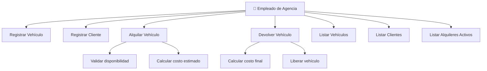

# Diagrama de Casos de Uso — AutoRent

```mermaid
flowchart TD
    Actor["👤 Empleado de Agencia"]

    Actor --> CU1["Registrar Vehículo"]
    Actor --> CU2["Registrar Cliente"]
    Actor --> CU3["Alquilar Vehículo"]
    Actor --> CU4["Devolver Vehículo"]
    Actor --> CU5["Listar Vehículos"]
    Actor --> CU6["Listar Clientes"]
    Actor --> CU7["Listar Alquileres Activos"]

    CU3 --> CU3a["Validar disponibilidad"]
    CU3 --> CU3b["Calcular costo estimado"]
    CU4 --> CU4a["Calcular costo final"]
    CU4 --> CU4b["Liberar vehículo"]
```
