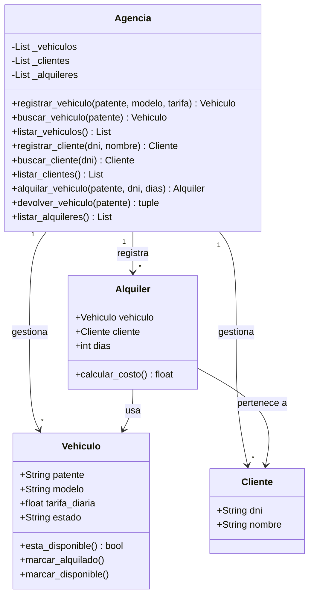

# Diagrama de Clases — AutoRent

```mermaid
classDiagram
    class Vehiculo {
        +String patente
        +String modelo
        +float tarifa_diaria
        +String estado
        +esta_disponible() bool
        +marcar_alquilado()
        +marcar_disponible()
    }

    class Cliente {
        +String dni
        +String nombre
    }

    class Alquiler {
        +Vehiculo vehiculo
        +Cliente cliente
        +int dias
        +calcular_costo() float
    }

    class Agencia {
        -List _vehiculos
        -List _clientes
        -List _alquileres
        +registrar_vehiculo(patente, modelo, tarifa) Vehiculo
        +buscar_vehiculo(patente) Vehiculo
        +listar_vehiculos() List
        +registrar_cliente(dni, nombre) Cliente
        +buscar_cliente(dni) Cliente
        +listar_clientes() List
        +alquilar_vehiculo(patente, dni, dias) Alquiler
        +devolver_vehiculo(patente) tuple
        +listar_alquileres() List
    }

    Agencia "1" --> "*" Vehiculo : gestiona
    Agencia "1" --> "*" Cliente : gestiona
    Agencia "1" --> "*" Alquiler : registra
    Alquiler --> Vehiculo : usa
    Alquiler --> Cliente : pertenece a
```
