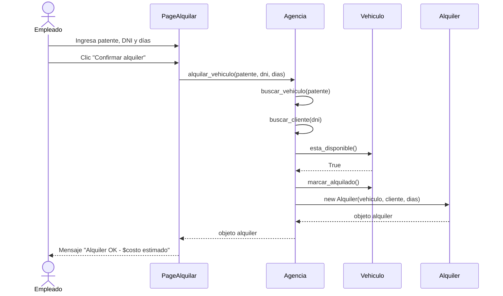

# Diagrama de Secuencia — Flujo de Alquiler

```mermaid
sequenceDiagram
    actor Empleado
    participant UI as PageAlquilar
    participant Agencia
    participant Vehiculo
    participant Alquiler

    Empleado->>UI: Ingresa patente, DNI y días
    Empleado->>UI: Clic "Confirmar alquiler"
    UI->>Agencia: alquilar_vehiculo(patente, dni, dias)
    Agencia->>Agencia: buscar_vehiculo(patente)
    Agencia->>Agencia: buscar_cliente(dni)
    Agencia->>Vehiculo: esta_disponible()
    Vehiculo-->>Agencia: True
    Agencia->>Vehiculo: marcar_alquilado()
    Agencia->>Alquiler: new Alquiler(vehiculo, cliente, dias)
    Alquiler-->>Agencia: objeto alquiler
    Agencia-->>UI: objeto alquiler
    UI-->>Empleado: Mensaje "Alquiler OK - $costo estimado"
```
